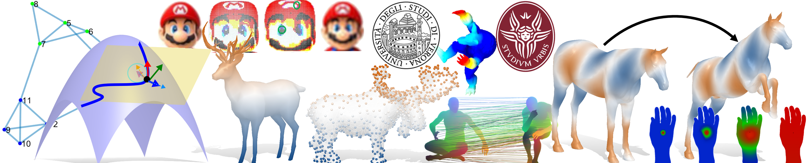

# SpectralShapeAnalysis

This is the Repository for the course of Spectral Shape Analysis, yields at the University of Verona, 28th, 29th and 31th July 2020.

Click on the Binder button above to lunch the environment for the exercises.

---

### Available Projects
This is a (non-exaustive) list of possibilities for the final exam. \
[Coming Soon]

---

### References
This is a (hopefully exaustive) list of resources that inspired our course.\
[Coming Soon]
